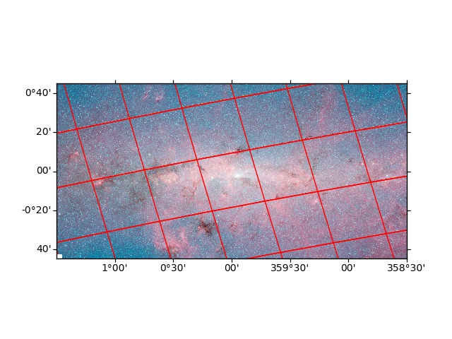

---
title: 'A Python astronomy package for HiPS: Hierarchical Progressive Surveys'
tags:
- python
- astronomy
- science
- image-viewer
- image-processing

authors:
- name: Adeel Ahmad
  orcid: 0000-0001-5035-4497
  affiliation: 1

- name: Christoph Deil
  orcid: 0000-0002-4198-4005
  affiliation: 2

- name: Thomas Boch
  orcid: 0000-0001-5818-2781
  affiliation: 3

- name: Brigitta M Sipőcz
  orcid: 0000-0002-3713-6337
  affiliation: 4

- name: Axel Donath
  orcid: 0000-0003-4568-7005
  affiliation: 2

affiliations:
- name: National University of Computer and Emerging Sciences, Islamabad, Pakistan
  index: 1
- name: Max Planck Institute for Nuclear Physics, Heidelberg, Germany
  index: 2
- name: Université de Strasbourg, CNRS, Observatoire astronomique de Strasbourg
  index: 3
- name: Institute of Astronomy, University of Cambridge, Madingley Road, Cambridge, CB3 0HA, UK
  index: 4

date: 5 July 2018
bibliography: paper.bib
---

# Summary
The `hips` package allows users to fetch and draw HiPS data. It supports Python 3.6 or later and runs on most operating systems including Linux, Windows, and macOS. The HiPS (Hierarchical Progressive Surveys) scheme [@hips] is built upon the HEALPix framework [@healpix] and provides a way to store large astronomical survey sky images and catalog datasets on servers (such as HiPS at CDS  (\url{http://aladin.u-strasbg.fr/hips})), that allows clients to efficiently fetch only the image tiles or catalog parts for a given region of the sky they are interested in.

Currently, there are clients built using HiPS, such as Aladin Desktop (\url{http://aladin.unistra.fr/AladinDesktop}) and Aladin Lite (\url{http://aladin.unistra.fr/AladinLite}), but they are written in Java and JavaScript, respectively. There is also `ipyaladin` (\url{https://github.com/cds-astro/ipyaladin}), which provides a bridge between Jupyter and Aladin Lite, and enables interactive sky visualization in IPython notebooks.

The presented package provides the functionality for drawing a sky image from HiPS tiles, transforming HiPS to WCS images, and HEALPix to HiPS---which takes in HEALPix data stored in the "nested" scheme and creates a dictionary object containing HiPS. Additional features include progress bar reporting (`tqdm` \url{https://github.com/tqdm/tqdm}), asynchronous tile fetching (`aiohttp` \url{https://github.com/aio-libs/aiohttp}), image input / output (`pillow` \url{https://python-pillow.org}), and support for multiple image formats including FITS, PNG, and JPG. The FITS format stores image metadata in a human-readable ASCII header and is the standard for astronomical applications. Whereas, PNG and JPG formats contain RGB color images.

The modules provided by this package mostly build upon Astropy [@2018arXiv180102634T] affiliated packages, namely, `astropy-healpix` (\url{https://github.com/astropy/astropy-healpix}) and `reproject` (\url{https://reproject.readthedocs.io}).

We also acknowledge `skimage` [@scikit-image] for their projective transformation module which we apply for projecting HiPS tiles onto the sky image. To achieve this, we first compute the tile corners, which help us in determining the position where the tile is to be placed. The tiles are further split into four children tiles to fix the tile distortion issue, which results in a more precise image.

For a more comprehensive introduction to the `hips` package, please see the documentation at (\url{https://hips.readthedocs.io}) and the source code at (\url{https://github.com/hipspy/hips}).

# Acknowledgements
This project was initiated as part of Google Summer of Code 2017 program (\url{https://summerofcode.withgoogle.com}) under the Open Astronomy umbrella organization. During this period v0.1 and v0.2 was released. The release of v0.3 is expected in summer 2018. The authors would like to thank Google for hosting this program.

# References
