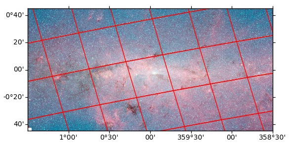

# Summary
HiPS (Hierarchical Progressive Surveys) [@hips] is built upon the HEALPix framework [@healpix] and provides a way to store large astronomical survey sky images and catalog datasets on servers (such as HiPS at CDS  (\url{http://aladin.u-strasbg.fr/hips}), that allows clients to efficiently fetch only the image tiles or catalog parts for a given region of the sky they are interested in.

Currently, there are clients built using HiPS, such as Aladin Desktop (\url{http://aladin.unistra.fr/AladinDesktop}) and Aladin Lite (\url{http://aladin.unistra.fr/AladinLite}) but they are written in Java and JavaScript, respectively. There is also ipyaladin (\url{https://github.com/cds-astro/ipyaladin}), which provides a bridge between Jupyter and Aladin Lite, and enables interactive sky visualization in IPython notebooks.

## Scope of the Package
The `hips` package provides flexibility by extending both a high-level and low-level API for novice and advanced users, respectively. It provides the functionality for drawing a sky image from HiPS tiles, transforming HiPS to WCS images, and HEALPix to HiPS---which takes in HEALPix data stored in the "nested" scheme and creates a dictionary object containing HiPS. Additional features include progress bar reporting, asynchronous tile fetching, and support for multiple image formats.

For a more comprehensive introduction to the `hips` package, please see the documentation at (\url{http://hips.readthedocs.io}) and the source code at (\url{http://github.com/hipspy/hips}).

## Tile Drawing Algorithm
Projective transformation is applied for projecting HiPS tiles onto the sky image. To achieve this, we first compute the tile corners, which helps us in determining the position where the tile is to be placed. The tiles are further split into four children tiles, which is done to fix the tile distortion issue, and results in a more precise image.

# Example Usage
A sky image from HiPS image tiles can be drawn with the `hips` package, following these steps:

```python
from astropy.coordinates import SkyCoord
from hips import WCSGeometry, make_sky_image

# 1. Specify the sky image geometry by creating
# a`WCSGeometry` object.
geometry = WCSGeometry.create(
    skydir=SkyCoord(0, 0, unit='deg', frame='galactic'),
    width=2000, height=1000, fov="3 deg",
    coordsys='galactic', projection='AIT',
)

# 2. Provide a valid HiPS survey ID.
hips_survey = 'CDS/P/DSS2/red'

# 3. Fetch and draw the HiPS data using the
# make_sky_image function.
result = make_sky_image(geometry, hips_survey, 'png')
```
This procedure produces the following image:



# Acknowledgements
This project was initiated as part of Google Summer of Code 2017 program (\url{https://summerofcode.withgoogle.com}) under the Open Astronomy umbrella organization. The authors would like to thank Google for hosting this program. We gratefully acknowledge Astropy [@2018arXiv180102634T] for their affiliated packages, such as astropy-healpix (\url{https://github.com/astropy/astropy-healpix}) and reproject (\url{https://reproject.readthedocs.io}). We also acknowledge skimage [@scikit-image] for their projective transformation module which is extensively used in this package.

# References
